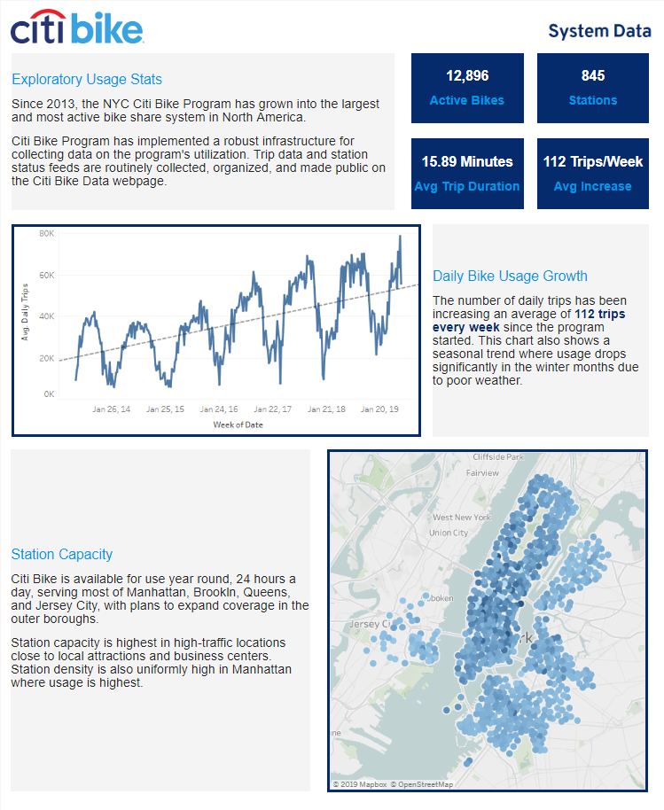

# Citi Bike Analytics

This Tableau workbook is intended to for city officials looking to publicize and improve the bike share program.

Since 2013, the Citi Bike Program has implemented a robust infrastructure for collecting data on the program's utilization. Each month bike data is regularly collected, organized, and made public on the [Citi Bike Data](https://www.citibikenyc.com/system-data) webpage.

This is a set of data dashboards that capture key metrics and provide an analysis of the growth strategies program officials could employ to sustain service capacity.

## Tableau Dashboard

The reporting dashboard is published on [Tableau Public](https://public.tableau.com/profile/willy.goal#!/vizhome/CitiBike_15611962414630/CitiBike).

